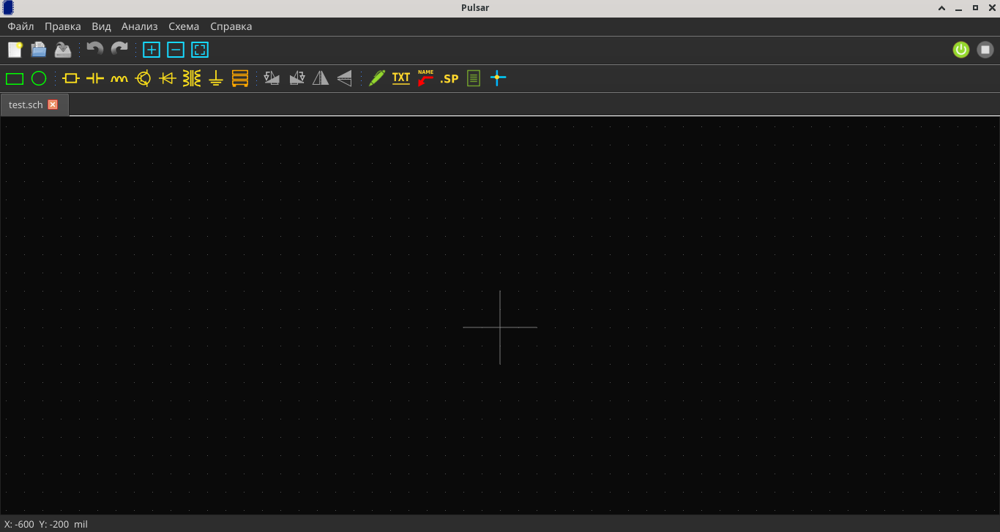

# Установка

## 1. Установите ngspice

Pulsar использует ngspice для симуляций. Установите его через пакетный менеджер:

=== "Ubuntu / Debian"

    ```bash
    sudo apt install ngspice
    ```

=== "Fedora"

    ```bash
    sudo dnf install ngspice
    ```

=== "macOS (Homebrew)"

    ```bash
    brew install ngspice
    ```

Проверьте установку:

```bash
ngspice --version
```

## 2. Установите зависимости Python

```bash
cd Pulsar
pip install -r requirements.txt
```

Содержимое `requirements.txt`:

```
PySide6
matplotlib
numpy
```

## 3. Запустите Pulsar

```bash
python3 main.py
```

Появится экран-заставка, затем главное окно приложения.



## Сборка исполняемого файла (опционально)

Для создания автономного ELF-файла без Python:

```bash
pip install pyinstaller
pyinstaller Pulsar.spec
```

Результат будет в `dist/Pulsar` (~90 МБ).
