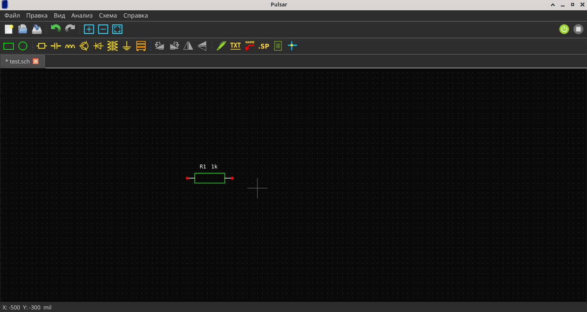
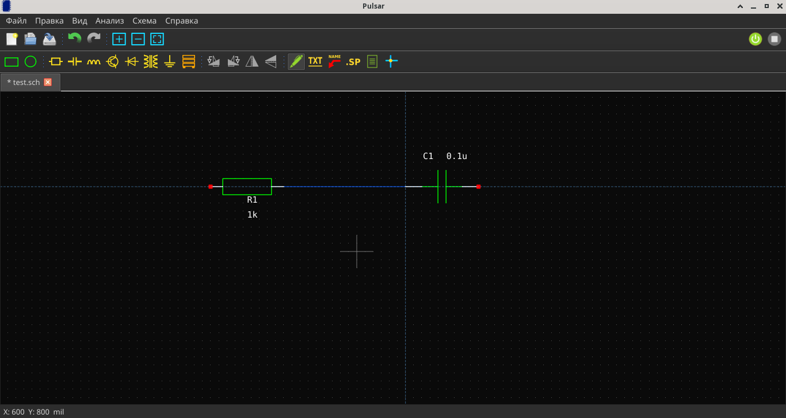
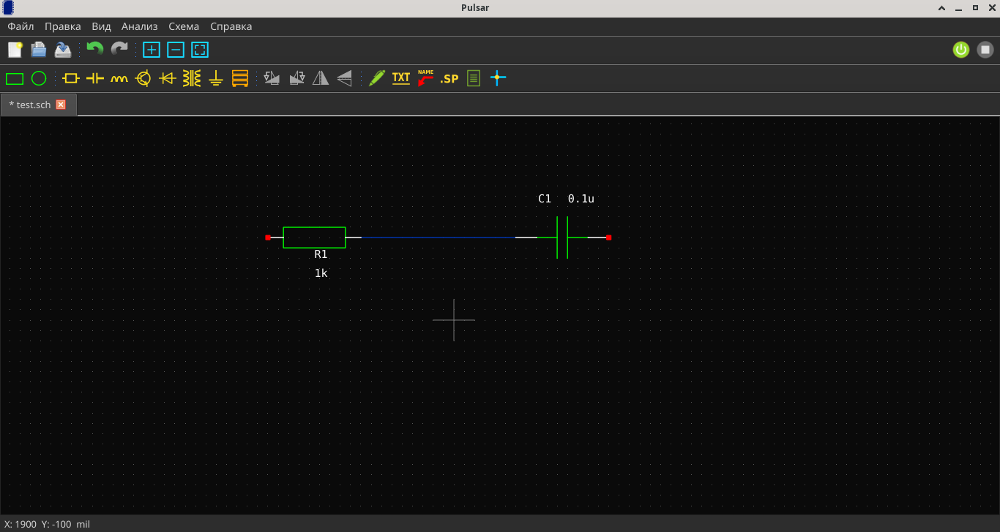
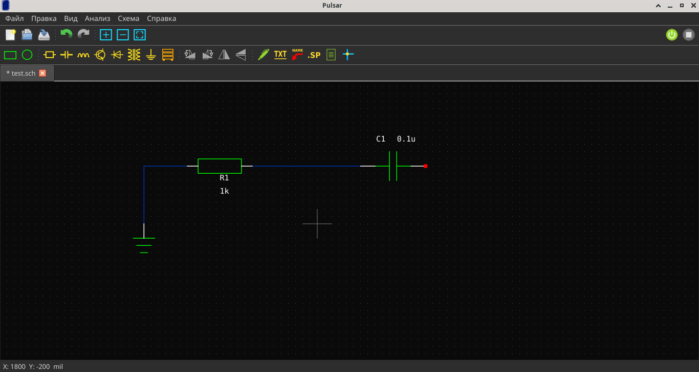
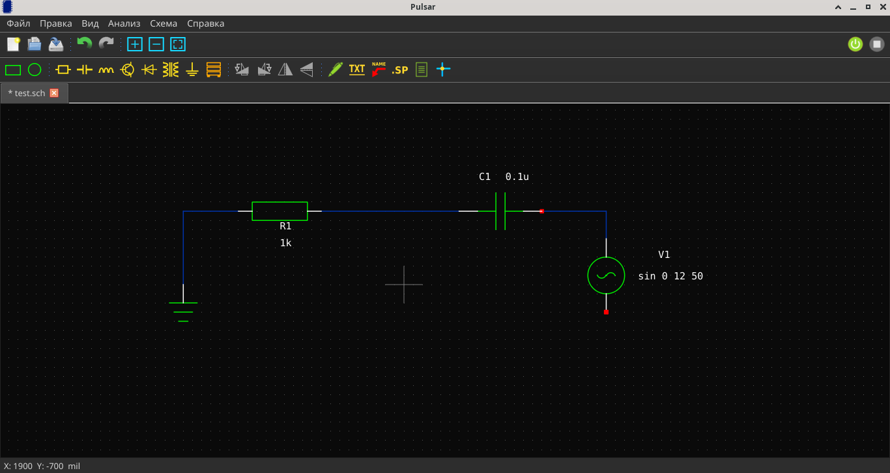
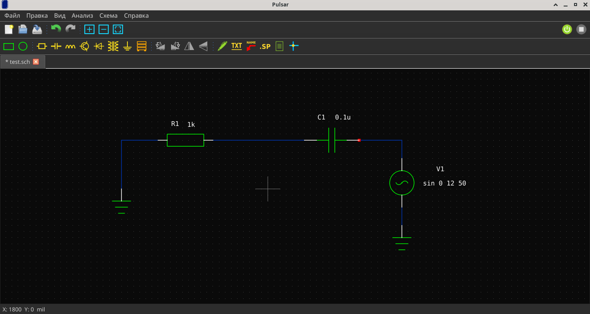

# Первая схема

В этом руководстве мы создадим простой RC-фильтр: резистор + конденсатор + источник напряжения + земля.

## Шаг 1. Создайте новый файл

Нажмите **Ctrl+N** или кнопку **«Новый файл»** в тулбаре. Выберите расширение `.sch`.

## Шаг 2. Разместите резистор

Откройте панель компонентов слева (если скрыта — **Вид → Панель компонентов**).

Найдите раздел **Passive → resistor-2** и перетащите его на схему.

## Шаг 3. Разместите конденсатор

Перетащите **Passive → capacitor-1** на схему рядом с резистором.

## Шаг 4. Нарисуйте провод

Нажмите клавишу **N** или кнопку **«Провод»** в тулбаре. Курсор станет карандашом.

Кликните по пину резистора, затем по пину конденсатора — провод соединит их.

## Шаг 5. Добавьте землю

Нажмите клавишу **G** или кнопку **«Земля»** в тулбаре. Разместите под конденсатором.

Свяжите конденсатор и землю проводом (режим **N**).

## Шаг 6. Добавьте источник напряжения

Перетащите **Sources_Voltage → vsin-1** из панели компонентов. Свяжите его с резистором и землёй проводами.

## Шаг 7. Проверьте схему

Убедитесь, что все компоненты соединены проводами и есть земля (GND).

!!! tip "Подсказка"
    Используйте клавишу **R** для быстрого размещения резистора, **C** — конденсатора, **D** — диода.

!!! warning "Важно"
    Земля (GND) обязательна для любой схемы. Без неё симуляция не запустится.
