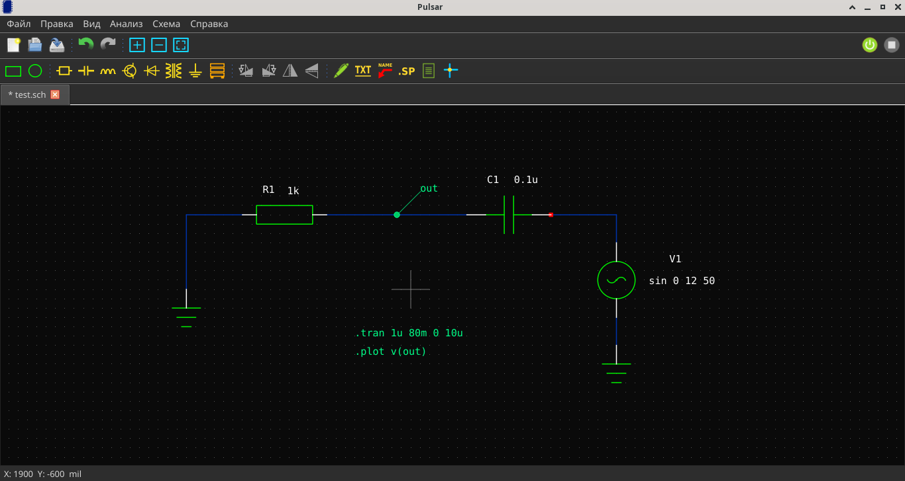

# Первая симуляция

## Шаг 1. Сохраните схему

Нажмите **Ctrl+S**. Схема сохранится как `.sch` файл, а рядом автоматически создастся `.cir` файл с SPICE-нетлистом.

## Шаг 2. Добавьте директиву анализа

Нажмите клавишу **"."** (точка) или **Схема → Добавить директиву**.

Введите:

```
.tran 0.1ms 10ms
```

Это задаст транзиентный анализ: шаг 0.1 мс, общее время 10 мс.

Разместите директиву на схеме кликом.

## Шаг 3. Добавьте .PRINT

Ещё одна директива:

```
.print tran V(out)
```

Замените `V(out)` на имя узла, где хотите измерить напряжение. Или используйте `V(*)` для всех узлов.

## Шаг 4. Запустите симуляцию

Нажмите **F5** или кнопку **«Пуск»** в тулбаре.

Внизу появится прогресс-бар:



!!! info "Что происходит"
    1. Схема конвертируется в .cir нетлист
    2. Запускается `ngspice -b file.cir`
    3. Вывод ngspice появляется в терминале на вкладке
    4. Результаты автоматически открываются в плоттере

## Шаг 5. Проверьте вывод

После завершения в терминале будет отчёт ngspice:

```
Binary raw file... done.
```

Если есть ошибки — они будут видны в терминале.

!!! warning "Частые ошибки"
    - **Нет GND** — добавьте компонент земли (G)
    - **Нет .TRAN** — добавьте директиву анализа
    - **Нет .PRINT** — ngspice не сохранит данные для графика
