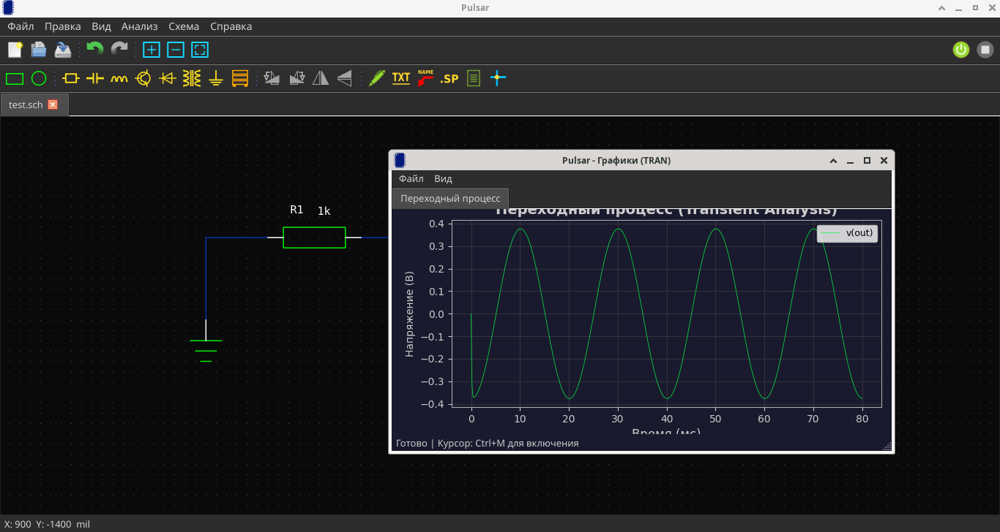

# Просмотр графика

После успешной симуляции Pulsar автоматически открывает окно плоттера с графиками.

## Окно плоттера



### Что показывает график

- **Ось X** — время (для транзиентного анализа)
- **Ось Y** — напряжение или ток (зависит от `.PRINT` директивы)
- Каждая переменная — на отдельном subplot

### Управление

| Действие | Как |
|----------|-----|
| Курсор | Мышь — вертикальная линия на всех осях |
| Зуммирование | Колёсико мыши на графике |
| Сохранение | **Ctrl+S** → сохранить в JPEG |

## Анализ不同类型

### TRAN (транзиентный)

Показывает изменение во времени. Ось X — время в секундах.

```
.tran 0.1ms 10ms
.print tran V(out)
```

### DC ( характеристика)

Показывает зависимость от источника. Ось X — напряжение/ток источника.

```
.dc Vin 0 5 0.1
.print dc V(out)
```

### AC (частотная)

Показывает амплитуду и фазу. Ось X — частота в Гц.

```
.ac dec 100 1 1Meg
.print ac V(out)
```

### OP (рабочая точка)

Показывает постоянные значения напряжений и токов.

```
.op
```

!!! tip "Подсказка"
    В меню **Анализ → Анализ по постоянному току** можно быстро получить рабочую точку без ручного ввода `.OP`.
