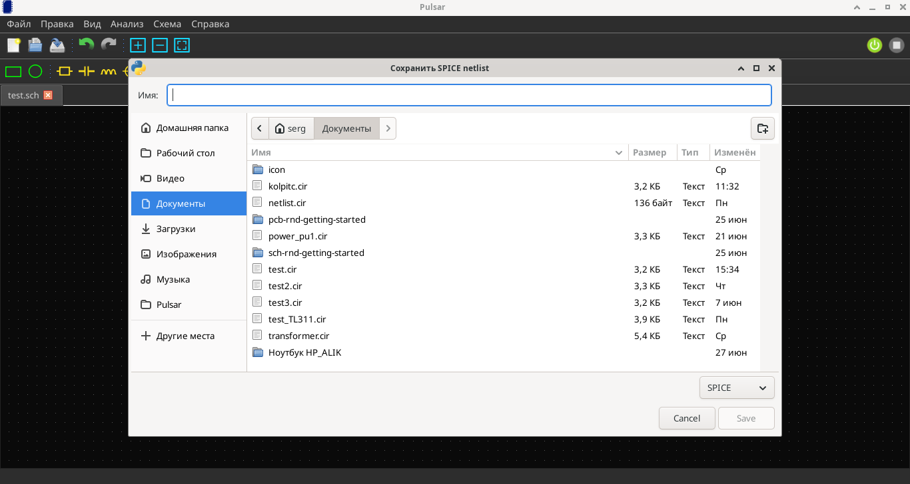
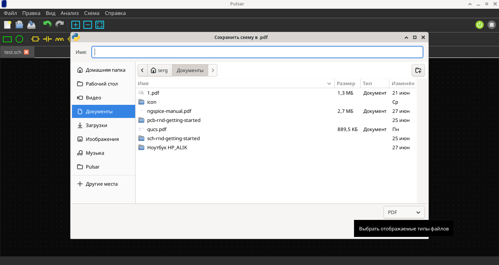
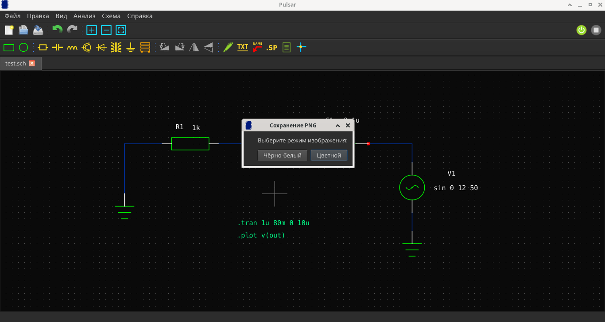

# Экспорт

Pulsar поддерживает экспорт в несколько форматов.

## Экспорт в SPICE (.cir)

Нетлист `.cir` создаётся автоматически при каждом сохранении `.sch` файла.

### Ручной экспорт

**Схема → Экспорт SPICE netlist** — сохраняет `.cir` файл по выбранному пути.



### Что внутри

```spice
* RC фильтр
V1 1 0 SIN(0 5 1k)
R1 1 2 1k
C1 2 0 100n
.tran 0.1ms 10ms
.print tran V(2)
.end
```

!!! info "Авто-перезагрузка"
    Если `.cir` файл открыт в другой вкладке, он автоматически обновится при сохранении схемы.

## Экспорт в PDF

**Файл → Сохранить схему в .pdf…**

- Формат A4 (landscape)
- Тёмный фон по умолчанию
- 300 DPI



## Экспорт в PNG

**Файл → Сохранить схему в .png…**

Перед сохранением выберите режим:

| Режим | Описание |
|-------|----------|
| **Цветной** | Тёмный фон, оригинальные цвета |
| **Чёрно-белый** | Белый фон, чёрные линии (для печати) |



!!! tip "Подсказка"
    Чёрно-белый режим использует threshold → все цветные элементы становятся чёрными на белом фоне. Идеально для документации и печати.

## Экспорт tEDAx (pcb-rnd)

**Схема → Экспорт tEDAx (pcb-rnd)…**

Экспорт в формате tEDAx для дальнейшей трассировки в pcb-rnd.
